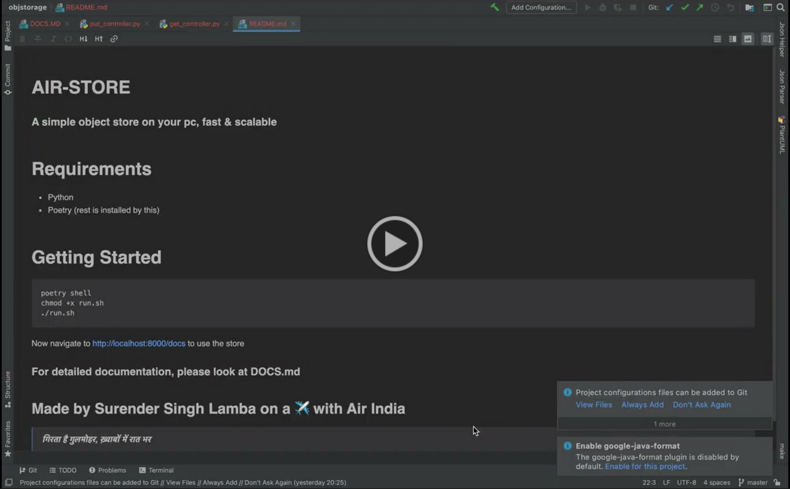

# AIR-STORE
### A simple object store on your pc, fast & scalable

# Requirements
- Python
- Poetry (rest is installed by this)

#Getting Started
```shell
poetry shell
chmod +x run.sh
./run.sh
```

Now navigate to http://localhost:8000/docs to use the store

### For detailed documentation, please look at [DOCS.MD](DOCS.MD)
## Made by Surender Singh Lamba on a ✈️ with Air India

[](https://drive.google.com/file/d/1VPv3eA8myvmXKzWEEP6skL7vGU63rWvS/view?usp=sharing)
